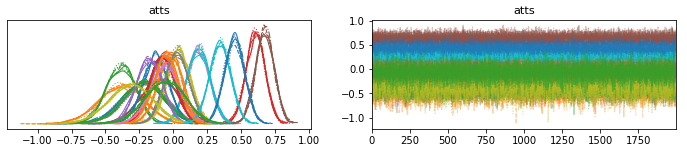

# **Predicting Match Results in the Portuguese First League of Football**

Predicting football match outcomes is a compelling challenge for analysts and enthusiasts. This project focuses on modelling the attacking and defensive strength of teams in the Portuguese First League of Football, along with the impact of home advantage. By leveraging statistical analysis and modelling techniques, the goal is to estimate the probabilities of different match results, offering valuable insights into team performance throughout the season.

**Model I** - *Poisson* Distribution  
**Model II** - *Dixon* and *Coles* Model  
**Model III** - Bayesian Hierarchical Model and PyMC3  

Pyhton stack: pandas, matplotlib, seaborn, numpy, scipy, pymc3, theano
